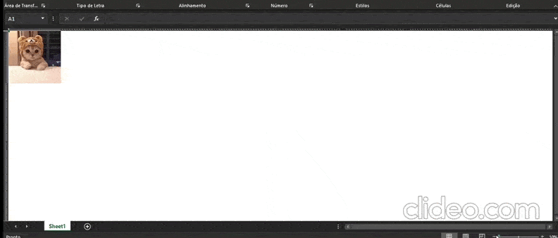

# img2excel
You found the right repository in case you're searching for useless scripts.

- This aw3s0sm3 script creates a spreadsheet where each cell is filled with the respective pixel color on the image.

- Then it configures column width, row height and zoom to make it better for visualization.

- Voilá, you have your image on a spreadsheet (literally)

# Dependencies
If you want to test it out, follow this steps:

- First install Python and PIP (normally, on Windows, Python comes with PIP)

- Second clone this repository or download it as ZIP (and unzip it)

- Third open a terminal inside repository's folder

- Fourth create a virtual environment: `pip -m venv env`

- Fith activate the environment:
    - On Windows: `\env\Scripts\activate.bat`
    - On Linux/Unix: `source env/bin/activate`

- Sixth install dependencies: `pip install -r requirements.txt`

- Seventh execute the script: `python img2excel.py -i /path/to/image -f /path/to/save/spreadsheet/file`

- Eighth enjoy your spreadsheet!

# Demo

